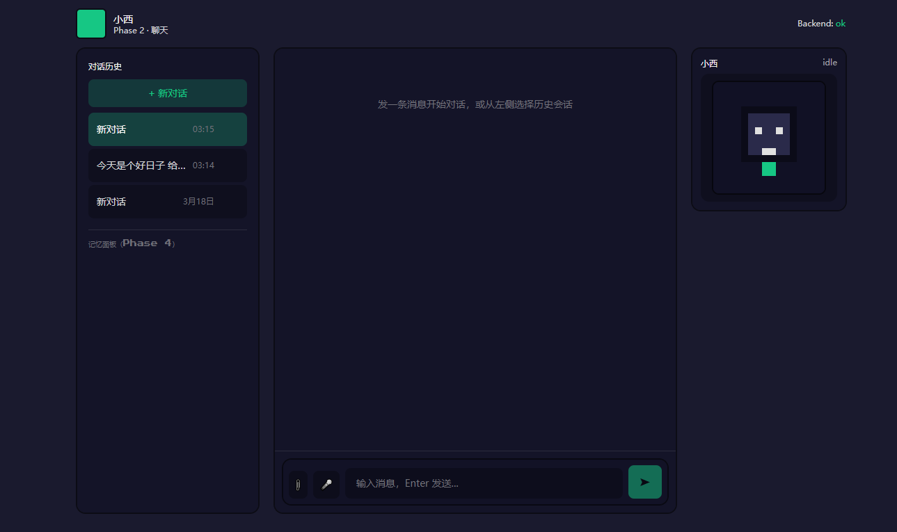

# 小西（本地智能助理）Phase 1 + 2


本项目将按你提供的 Phase 逐步实现。当前已完成：

- **Phase 1**：前后端骨架、CORS、健康检查、启动脚本
- **Phase 2**：豆包（火山方舟 Ark）对话、SSE 流式、会话列表与消息气泡、右侧像素小西互动（Canvas）


---

## 本地部署（Windows）完整操作

### 0) 环境准备

- **Python**：建议 3.11+
- **Node.js**：建议 18+
- **网络**：能访问 `ark.cn-beijing.volces.com`

> 如果你用 conda/base 也可以，但后端会用 `backend\.venv` 这个独立虚拟环境装依赖，互不影响。

### 1) 配置豆包 API Key
1. 打开文件：`backend\.env`
2. 确认包含（示例）：

```text
ARK_API_KEY=你的APIKEY
DOUBAO_MODEL_ID=doubao-seed-2-0-mini-260215
DOUBAO_BASE_URL=https://ark.cn-beijing.volces.com/api/v3
```


### 2) 一键启动

在项目根目录双击 `start.bat`，它会打开两个窗口：

- **小西 后端**：FastAPI（http://127.0.0.1:8000）
- **小西 前端**：Vite（http://localhost:5173）

### 3) 分开启动（更稳、日志更清晰）

如果一键启动遇到问题，建议改用下面方式：

- 双击 `run-backend.bat` 启动后端
- 双击 `run-frontend.bat` 启动前端

### 4) 验收

1. 打开：`http://localhost:5173`
2. 你应该能看到：
   - 左侧：会话列表（可新建/切换/删除）
   - 中间：聊天区（输入后流式输出）
   - 右侧：像素风小西（idle/thinking/talking/happy/error）
3. 后端接口自检：
   - `http://127.0.0.1:8000/api/health` → `{"status":"ok"}`
   - `http://127.0.0.1:8000/api/config` → 检查 `has_ark_api_key` 是否为 `true`

---

